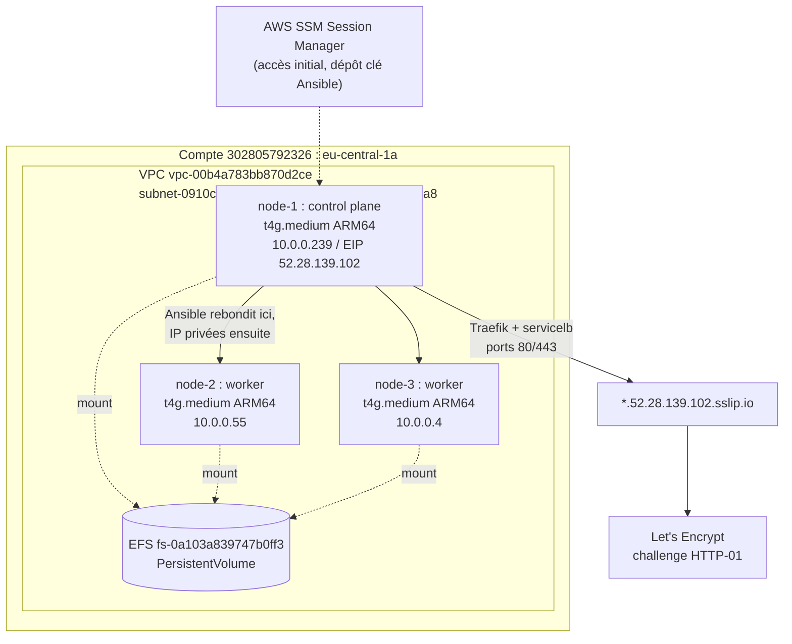
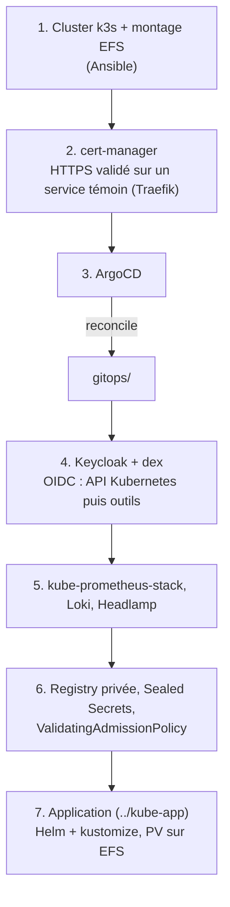

# KUBE - Infrastructure

Provisionnement du cluster Kubernetes et de ses composants transverses.
Le dépôt applicatif est dans `../kube-app`.

## Infrastructure

Compte AWS `302805792326`, région `eu-central-1`, AZ `eu-central-1a`.

| Nœud | Rôle | IP privée | IP publique | Instance |
|---|---|---|---|---|
| node-1 | control plane | `10.0.0.239` | `52.28.139.102` (Elastic) | `i-053b2016e9a5dc459` |
| node-2 | worker | `10.0.0.55` | non fixe | `i-0402d50c33a35cf19` |
| node-3 | worker | `10.0.0.4` | non fixe | `i-029a3af4299b00e26` |

Les instances sont des `t4g.medium` sous Amazon Linux 2023 : architecture ARM64,
2 vCPU et 4 Go de RAM chacune. L'accès se fait par AWS SSM Session Manager,
aucune clé SSH n'est associée aux instances au départ.

Les machines sont éteintes automatiquement chaque soir.

Le système de fichiers EFS partagé `fs-0a103a839747b0ff3` est monté sur les trois
nœuds et sert de support aux volumes persistants. Sa cible de montage se trouve
dans la même zone et le même groupe de sécurité que les nœuds.

VPC `vpc-00b4a783bb870d2ce`, sous-réseau `subnet-0910c5fbc38f2e216`, groupe de
sécurité `sg-0673c4428720f8ea8`.

### Topologie



Seule l'IP Elastic de node-1 survit à l'extinction quotidienne : c'est le point
d'entrée fixe du cluster, la cible d'Ansible, et la base des noms de domaine,
résolus via `*.52.28.139.102.sslip.io`.

## Contraintes

Ces quatre points conditionnent la plupart des choix qui suivent.

1. Toutes les images déployées doivent exister en `linux/arm64`.
2. Environ 11 Go de RAM utilisables au total pour la plateforme et
   l'application : il faut une distribution légère et des `requests` mesurées.
3. Aucun load balancer disponible, l'exposition se fait depuis node-1.
4. Les IP publiques des workers changent à chaque redémarrage, rien ne doit en
   dépendre : Ansible rebondit sur node-1 et les nœuds communiquent par leurs
   adresses privées.

## Composants imposés

Le sujet ne laisse pas le choix sur ces points.

| Composant | Rôle |
|---|---|
| Ansible | provisionnement du cluster, rejouable |
| dex | fournisseur OIDC devant l'IdP |
| Loki | collecte et visualisation des logs |
| kustomize | manifestes des dépôts GitOps |
| Helm | chart de l'application et chart officiel de la base |
| cert-manager et Let's Encrypt | certificats TLS |
| `ValidatingAdmissionPolicy` | contrôle d'admission natif, en CEL |
| Registry privée authentifiée | publication et tirage des images |
| PersistentVolume sur EFS | stockage de la base |
| CronJob | tâche d'exploitation périodique |

## Choix à justifier

Le sujet propose plusieurs options sur ces composants.

**Ingress plutôt que Gateway API.** La Gateway API demanderait d'installer une
implémentation supplémentaire pour un besoin de routage qui reste simple.

**Traefik**, celui livré par k3s. C'est le seul contrôleur déjà présent dans la
distribution : aucun composant à ajouter. Surtout, k3s l'expose par son
servicelb intégré, qui publie réellement les ports 80 et 443 sur les nœuds. Un
Ingress exposé en NodePort seul se situerait dans la plage 30000-32767 et ne
pourrait pas répondre au challenge HTTP-01 de Let's Encrypt, ce qui empêcherait
la génération automatique des certificats. Accessoirement, l'application fournie
utilisait déjà Traefik dans son docker-compose.

**Headlamp** comme dashboard. Il s'interface avec un fournisseur OIDC par simple
configuration, là où kubernetes-dashboard attend un token et s'intègre mal à une
chaîne dex, alors que le sujet demande de couvrir tous les outils.

**kube-prometheus-stack** pour le monitoring. Il fournit Prometheus,
Alertmanager, Grafana et les règles d'alerte système dans un seul chart.
VictoriaMetrics consommerait moins de mémoire mais imposerait d'assembler la
visualisation et l'alerting séparément. La rétention est réduite à 24 h pour
compenser.

**ArgoCD** comme opérateur GitOps. La soutenance demande de montrer l'état de
synchronisation et de santé des applications, ce que son interface affiche
directement, alors que Flux nécessiterait la ligne de commande. Il embarque de
plus dex, qui est imposé.

**Sealed Secrets** pour les secrets. External Secrets supposerait de déployer et
de sécuriser un backend externe. Sealed Secrets chiffre vers le cluster avec un
seul contrôleur, ce qui suffit à garantir qu'aucun secret en clair ne soit
commité.

**Keycloak** comme fournisseur d'identité, fédéré par dex. C'est l'exemple cité
par le sujet et il permet une gestion des utilisateurs et des groupes,
nécessaire pour mapper des rôles RBAC. Il est déployé avec sa base embarquée
pour limiter son empreinte mémoire.

## Choix hors sujet

Le sujet ne mentionne ni distribution Kubernetes ni produit de registry.

**k3s.** Avec 4 Go par nœud, un control plane kubeadm complet consomme une part
disproportionnée des ressources. k3s fournit un cluster conforme dans un seul
binaire, containerd, Traefik et servicelb inclus, et s'installe en une commande,
ce qui rend le rôle Ansible court et rejouable.

**registry:2** avec authentification htpasswd et TLS. Harbor est plus complet
mais lourd en mémoire et son support arm64 est incertain, alors que le besoin se
limite à une registry privée et authentifiée.

## Mise en route

Marche à suivre pour reprendre le projet depuis une machine vierge.

### 1. Accéder à l'infrastructure

Se connecter au portail IAM Identity Center avec son adresse Epitech, choisir le
compte `kubequest2-group-25` et le rôle `kubequest2-student`, puis sélectionner
la région Europe (Francfort).

Dans EC2 puis Instances, démarrer les trois instances si elles sont arrêtées.
Elles le sont chaque soir automatiquement.

Le groupe de sécurité n'ouvre ni le port 22 ni le port 6443 vers l'extérieur, et
le rôle étudiant ne permet pas de le modifier. Ansible et `kubectl` s'exécutent
donc depuis node-1, sur lequel on se connecte par Session Manager : sélectionner
l'instance, cliquer sur Se connecter, puis Gestionnaire de sessions SSM.

En ligne de commande, avec l'AWS CLI configurée :

```bash
aws ssm start-session --target i-053b2016e9a5dc459 --region eu-central-1
```

### 2. Préparer node-1

La session s'ouvre en tant que `ssm-user`. Tout le reste se fait sous
`ec2-user`, l'utilisateur par défaut des instances.

```bash
sudo su - ec2-user
sudo dnf install -y git ansible-core
ansible-galaxy collection install ansible.posix
git clone https://github.com/Yohan-Baechle/kubequest.git
```

### 3. Autoriser node-1 à joindre les workers

Ansible atteint node-2 et node-3 par SSH. Si node-1 n'a pas encore de clé :

```bash
ssh-keygen -t ed25519 -C "node-1-kubequest" -f ~/.ssh/id_ed25519 -N ""
cat ~/.ssh/id_ed25519.pub
```

Déclarer cette clé publique dans `ssh_public_keys`, au fichier
`inventory/group_vars/all.yml`, puis la déposer une première fois sur node-2 et
node-3 par Session Manager :

```bash
sudo -u ec2-user mkdir -p /home/ec2-user/.ssh
echo '<clé publique de node-1>' | sudo tee -a /home/ec2-user/.ssh/authorized_keys
sudo chmod 700 /home/ec2-user/.ssh
sudo chmod 600 /home/ec2-user/.ssh/authorized_keys
sudo chown -R ec2-user:ec2-user /home/ec2-user/.ssh
```

C'est la seule étape manuelle du provisionnement. Le rôle `ssh_keys` entretient
ensuite cette liste sur les trois nœuds.

### 4. Provisionner le cluster

```bash
cd kubequest/kube-infra/ansible
ansible-playbook playbooks/ping.yml
ansible-playbook playbooks/site.yml
```

`ping.yml` vérifie que les trois nœuds répondent et affiche leur système et leur
architecture. `site.yml` installe le cluster et dépose le kubeconfig dans
`~/.kube/config` sur node-1.

### 5. Vérifier

```bash
kubectl get nodes -o wide
kubectl get pods -A
df -h /mnt/efs
```

Trois nœuds `Ready` sont attendus, ainsi que Traefik et un pod `svclb-traefik`
par nœud dans `kube-system`. Sur `http://52.28.139.102`, un `404 page not found`
de Traefik confirme que les ports 80 et 443 sont publiés.

Pour vérifier que l'EFS est bien partagé entre les nœuds :

```bash
echo test | sudo tee /mnt/efs/pv/test.txt
ssh ec2-user@10.0.0.55 cat /mnt/efs/pv/test.txt
sudo rm /mnt/efs/pv/test.txt
```

### Reconstruire un cluster vierge

```bash
ansible-playbook playbooks/reset.yml
ansible-playbook playbooks/site.yml
```

`reset.yml` désinstalle k3s et démonte l'EFS, mais ne supprime pas le contenu de
`/mnt/efs/pv` : les données de la base survivent à la reconstruction.

### Après une extinction nocturne

Redémarrer les trois instances depuis la console. Le montage EFS et les services
k3s repartent seuls, par `fstab` et systemd. Vérifier avec `kubectl get nodes`.

## Ordre de déploiement

1. Cluster k3s et montage EFS avec Ansible
2. cert-manager, HTTPS validé sur un service témoin exposé par Traefik
3. ArgoCD, puis le reste des composants réconciliés depuis `gitops/`
4. Keycloak et dex, OIDC sur l'API Kubernetes puis sur les outils
5. kube-prometheus-stack, Loki et Headlamp
6. Registry privée, Sealed Secrets et `ValidatingAdmissionPolicy`
7. Application, voir `../kube-app`



## État actuel

Cluster provisionné : trois nœuds `Ready` en k3s v1.31.5, Traefik exposé sur les
ports 80 et 443, EFS monté sur `/mnt/efs`.

Reste à faire : les manifestes `gitops/` et un playbook de remise à zéro, requis
pour démontrer le provisionnement d'un cluster neuf en soutenance.
