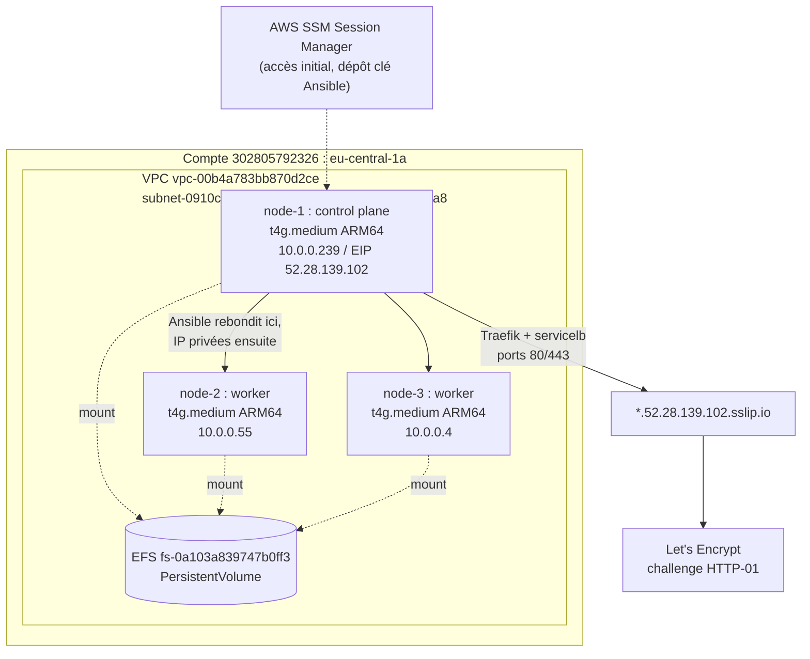
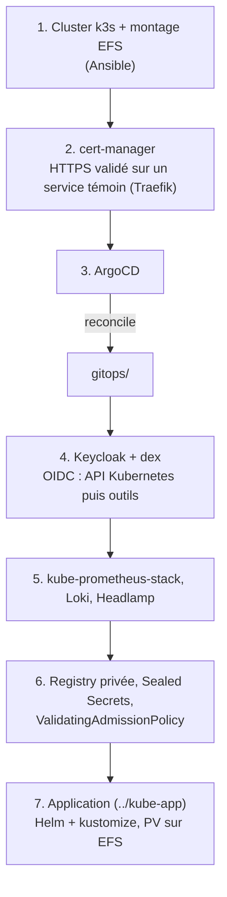

# KUBE - Infrastructure

Provisionnement du cluster Kubernetes et de ses composants transverses.
Le dépôt applicatif est dans `../kube-app`.

Les schémas d'architecture sont dans [`docs/architecture.md`](docs/architecture.md).

## Infrastructure

Compte AWS `302805792326`, région `eu-central-1`, AZ `eu-central-1a`.

| Nœud | Rôle | IP privée | IP publique | Instance |
|---|---|---|---|---|
| node-1 | control plane | `10.0.0.239` | `52.28.139.102` (Elastic) | `i-053b2016e9a5dc459` |
| node-2 | worker | `10.0.0.55` | non fixe | `i-0402d50c33a35cf19` |
| node-3 | worker | `10.0.0.4` | non fixe | `i-029a3af4299b00e26` |

Les instances sont des `t4g.medium` : architecture ARM64, 2 vCPU et 4 Go de RAM
chacune. L'accès se fait par AWS SSM Session Manager, aucune clé SSH n'est
associée aux instances au départ.

Les machines sont éteintes automatiquement chaque soir. Seule l'IP Elastic de
node-1 survit à ce cycle, c'est donc le point d'entrée du cluster et la base des
noms de domaine, résolus via `*.52.28.139.102.sslip.io`.

Le système de fichiers EFS partagé `fs-0a103a839747b0ff3` est monté sur les trois
nœuds et sert de support aux volumes persistants. Sa cible de montage se trouve
dans la même zone et le même groupe de sécurité que les nœuds.

VPC `vpc-00b4a783bb870d2ce`, sous-réseau `subnet-0910c5fbc38f2e216`, groupe de
sécurité `sg-0673c4428720f8ea8`.

### Topologie



Seule l'IP Elastic de node-1 survit à l'extinction quotidienne : c'est le
point d'entrée fixe du cluster, base des noms de domaine et cible d'Ansible.

## Contraintes

Ces quatre points conditionnent la plupart des choix qui suivent.

1. Toutes les images déployées doivent exister en `linux/arm64`.
2. 12 Go de RAM au total pour la plateforme et l'application : il faut une
   distribution légère et des `requests` mesurées.
3. Aucun load balancer disponible, l'exposition se fait depuis node-1.
4. Les IP publiques des workers changent à chaque redémarrage, rien ne doit en
   dépendre : Ansible rebondit sur node-1 et les nœuds communiquent par leurs
   adresses privées.

## Composants imposés

Le sujet ne laisse pas le choix sur ces points.

| Composant | Rôle |
|---|---|
| Ansible | provisionnement du cluster, rejouable |
| dex | fournisseur OIDC devant l'IdP |
| Loki | collecte et visualisation des logs |
| kustomize | manifestes des dépôts GitOps |
| Helm | chart de l'application et chart officiel de la base |
| cert-manager et Let's Encrypt | certificats TLS |
| `ValidatingAdmissionPolicy` | contrôle d'admission natif, en CEL |
| Registry privée authentifiée | publication et tirage des images |
| PersistentVolume sur EFS | stockage de la base |
| CronJob | tâche d'exploitation périodique |

## Choix à justifier

Le sujet propose plusieurs options sur ces composants.

**Ingress plutôt que Gateway API.** La Gateway API demanderait d'installer une
implémentation supplémentaire pour un besoin de routage qui reste simple.

**Traefik**, celui livré par k3s. C'est le seul contrôleur déjà présent dans la
distribution : aucun composant à ajouter. Surtout, k3s l'expose par son
servicelb intégré, qui publie réellement les ports 80 et 443 sur les nœuds. Un
Ingress exposé en NodePort seul se situerait dans la plage 30000-32767 et ne
pourrait pas répondre au challenge HTTP-01 de Let's Encrypt, ce qui empêcherait
la génération automatique des certificats. Accessoirement, l'application fournie
utilisait déjà Traefik dans son docker-compose.

**Headlamp** comme dashboard. Il s'interface avec un fournisseur OIDC par simple
configuration, là où kubernetes-dashboard attend un token et s'intègre mal à une
chaîne dex, alors que le sujet demande de couvrir tous les outils.

**kube-prometheus-stack** pour le monitoring. Il fournit Prometheus,
Alertmanager, Grafana et les règles d'alerte système dans un seul chart.
VictoriaMetrics consommerait moins de mémoire mais imposerait d'assembler la
visualisation et l'alerting séparément. La rétention est réduite à 24 h pour
compenser.

**ArgoCD** comme opérateur GitOps. La soutenance demande de montrer l'état de
synchronisation et de santé des applications, ce que son interface affiche
directement, alors que Flux nécessiterait la ligne de commande. Il embarque de
plus dex, qui est imposé.

**Sealed Secrets** pour les secrets. External Secrets supposerait de déployer et
de sécuriser un backend externe. Sealed Secrets chiffre vers le cluster avec un
seul contrôleur, ce qui suffit à garantir qu'aucun secret en clair ne soit
commité.

**Keycloak** comme fournisseur d'identité, fédéré par dex. C'est l'exemple cité
par le sujet et il permet une gestion des utilisateurs et des groupes,
nécessaire pour mapper des rôles RBAC. Il est déployé avec sa base embarquée
pour limiter son empreinte mémoire.

## Choix hors sujet

Le sujet ne mentionne ni distribution Kubernetes ni produit de registry.

**k3s.** Avec 4 Go par nœud, un control plane kubeadm complet consomme une part
disproportionnée des ressources. k3s fournit un cluster conforme dans un seul
binaire, containerd, Traefik et servicelb inclus, et s'installe en une commande,
ce qui rend le rôle Ansible court et rejouable.

**registry:2** avec authentification htpasswd et TLS. Harbor est plus complet
mais lourd en mémoire et son support arm64 est incertain, alors que le besoin se
limite à une registry privée et authentifiée.

## Utilisation

```bash
cd ansible
ansible-playbook playbooks/ping.yml
ansible-playbook playbooks/site.yml
export KUBECONFIG=$PWD/kubeconfig
kubectl get nodes -o wide
```

### Accès initial aux nœuds

Aucune clé SSH n'étant associée aux instances, la première connexion se fait par
Session Manager, où l'on dépose ensuite une clé publique pour Ansible.

```bash
aws ssm start-session --target i-053b2016e9a5dc459 --region eu-central-1
```

## Ordre de déploiement

1. Cluster k3s et montage EFS avec Ansible
2. cert-manager, HTTPS validé sur un service témoin exposé par Traefik
3. ArgoCD, puis le reste des composants réconciliés depuis `gitops/`
4. Keycloak et dex, OIDC sur l'API Kubernetes puis sur les outils
5. kube-prometheus-stack, Loki et Headlamp
6. Registry privée, Sealed Secrets et `ValidatingAdmissionPolicy`
7. Application, voir `../kube-app`



## État actuel

Provisionnement du cluster écrit, manifestes `gitops/` à venir.
