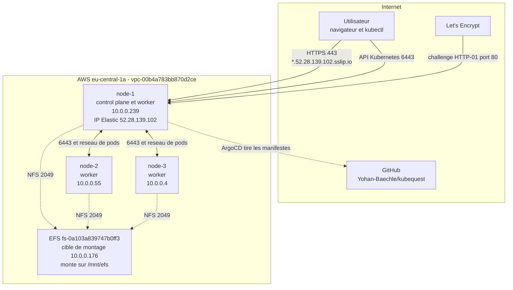
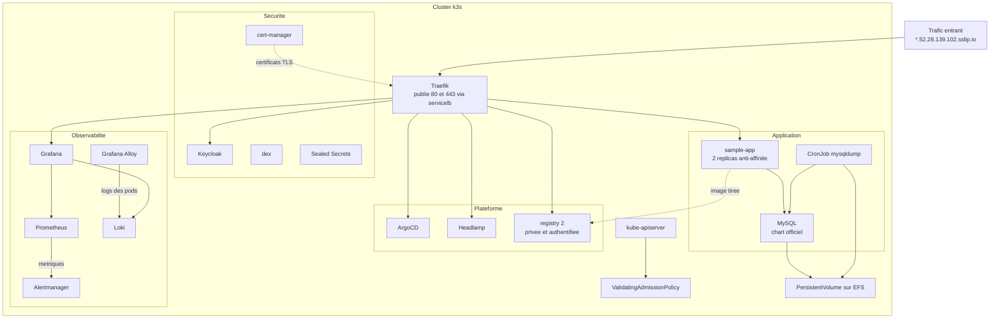
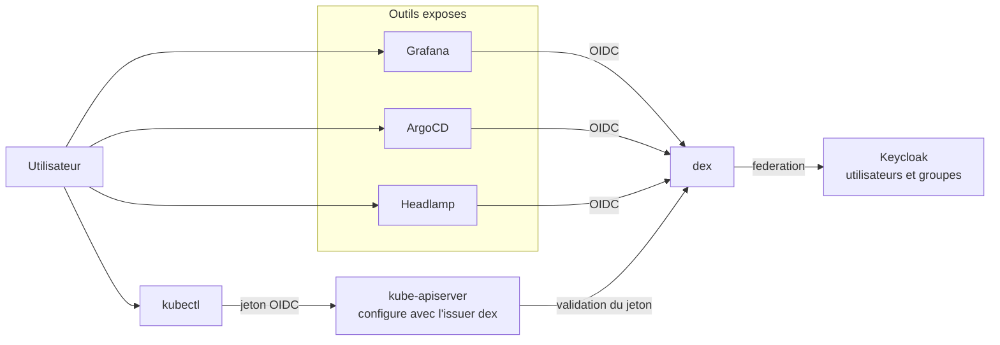
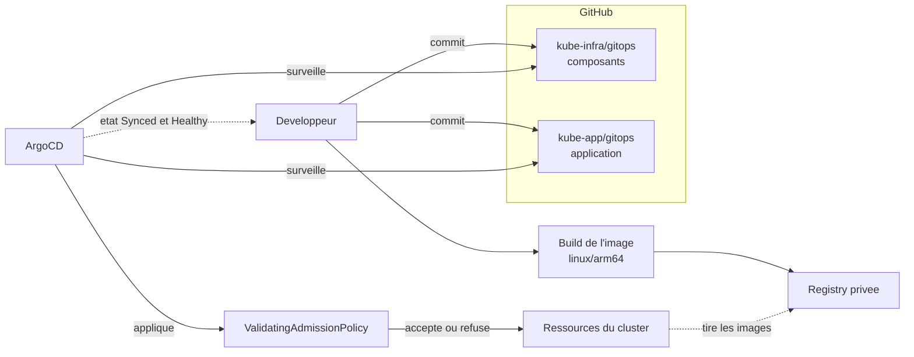
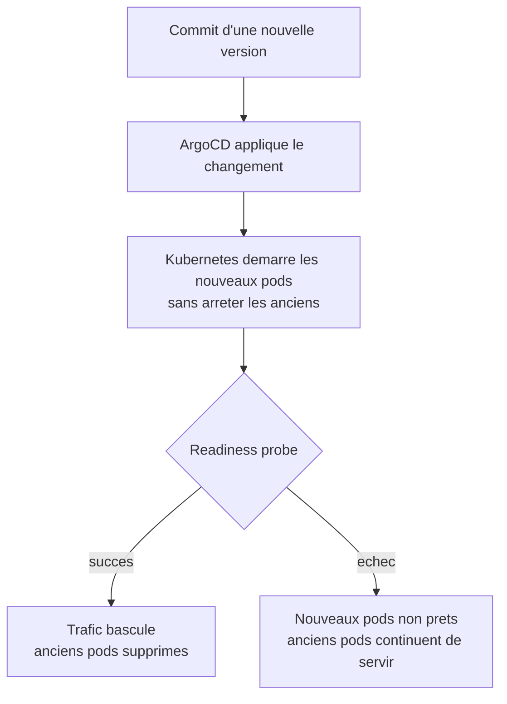

# Architecture

## Vue physique

Les trois instances EC2, le réseau et le stockage partagé.

Les workers n'ont pas d'adresse publique stable, tout le trafic entrant passe
par l'IP Elastic de node-1.

## Composants du cluster

## Chaîne d'authentification

Un seul compte donne accès à tous les outils et à l'API Kubernetes.

## Flux de déploiement GitOps

Aucun déploiement manuel, tout passe par un commit.

## Déploiement progressif

Comportement attendu lors d'une mise à jour, y compris fautive.

